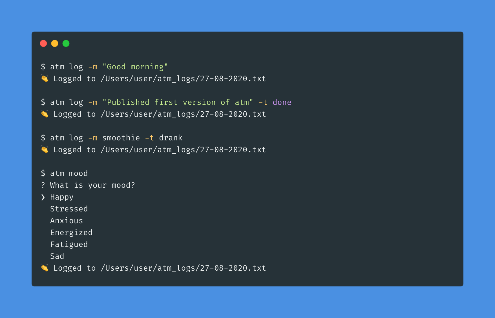

# atm – at the moment.

### A personal logging and tracking CLI.

A straightforward command-line interface for logging anything about your day and reviewing it later.



## Inspiration

Think software log files, but for you. They're versatile, easy to backup and are straightforward to parse for any data analysis you want to do. I got frustrated with having to use multiple apps for logging my daily activities, mood, food etc. The data gets fragment across all these different apps and you get no flexibility around how you get to view and analyse that data later.

## How it works

**atm** is simple. It writes logs into a `atm_log` folder in your user directory. One log file per day (`dd-mm-yyyy.txt`). One line per log in each file. All of it's stored locally, you can back them up, and use them however you like.

## Installation

```sh-session
$ npm install -g @udarajay/atm
```

## How to use atm

Once your have `atm` installe on your computer you should be able to run `atm` commands from your terminal.

### `atm log`

For logging things in general.

Accepts a `-m` flag for the `message` and an optional `-t` flag for `type`. Type can be absolutely anything you want, but there are some types that `atm` can understand and review for you when you use the review command.

Example:

```sh-session
$ atm log -m "Good morning"
👏 Logged to /Users/user/atm_logs/27-08-2020.txt

$ atm log -m "Published first version of atm" -t done
👏 Logged to /Users/user/atm_logs/27-08-2020.txt

$ atm log -m smoothie -t drank
👏 Logged to /Users/user/atm_logs/27-08-2020.txt
```

### `atm mood`

For mood tracking.

Run the command `atm mood` and follow the prompts.

```sh-session
$ atm mood
? Name the feeling? (Pick the first you relate to atm) Happy/Aliveness
? What caused this feeling? something
? Behaviors or actions this feeling caused me to take? nothing
? Is this feeling appropriate to the situation? why not
? What can I do to improve/fix it? (Remember to be kind to yourself) why fix
👏 Logged to /Users/user/atm_logs/13-09-2020.txt
```

### `atm decision`

Decision journal.

Run the command `atm decision` and follow the prompts.

```sh-session
$ atm decision
? The decision you made: Updating atm logs
? Mental/Physical state: Focused
? Situation/Context: stream coding
? The problem statement or frame: stream coding
👏 Logged to /Users/user/atm_logs/13-09-2020.txt
```

### `atm review`

View your logs.

- `atm review` // Day
- `atm review week`
- `atm review month`

OPTIONS
-x, --extended show extra columns
--columns=columns only show provided columns (comma-seperated)
--csv output is csv format
--filter=filter filter property by partial string matching, ex: name=foo
--no-header hide table header from output
--no-truncate do not truncate output to fit screen
--sort=sort

```sh-session
$ atm review
Summary of all logs
┌─────────┬────────┐
│ (index) │ Values │
├─────────┼────────┤
│   log   │   7    │
│  done   │   3    │
│  mood   │   2    │
│  quote  │   1    │
└─────────┴────────┘
Mood(s) in timespan
┌─────────┬────────┐
│ (index) │ Values │
├─────────┼────────┤
│ Happy   │   3    │
│ Anxious │   1    │
└─────────┴────────┘

Time   Type     Message
13:45  mood     Unsettled/Doubt
16:15  mood     Accepting/Content
16:27  mood     Hopeful
16:34  quote    lorem ipsum
16:52  decision added a decision journal to atm
17:03  mood     Happy/Aliveness
17:05  decision Updating atm logs
```
